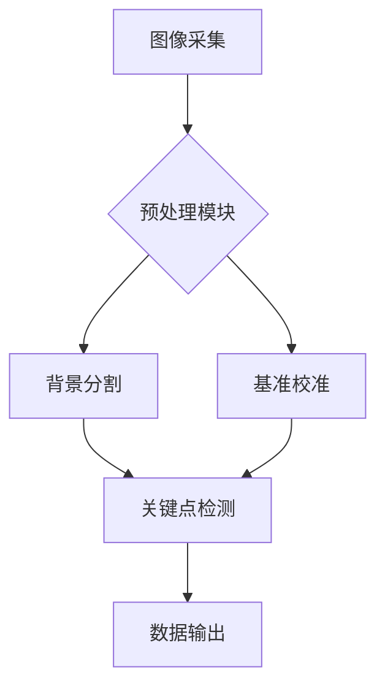

<p align="center">
  
</p>

<h1 align="center">CeFish 测鱼宝 - 智能鱼类表型分析系统</h1>

<div align="center">
  
  
  
</div>

---

## 🌟 核心优势
💡 **四维技术突破**：
1️⃣ **智能测量** - 单张图片解析14+体尺性状（体长/体宽/鳍长等）<br>
2️⃣ **广谱识别** - 支持大黄鱼、加州鲈等9大经济鱼种<br>
3️⃣ **环境宽容** - 复杂背景自适应，缩放比例自动校准<br>
4️⃣ **数据精准** - 误差率＜0.5%，较人工测量效率提升300%

▶️ [点击查看检测标准示意图](https://github.com/miaomiaoge/CeFish/assets/43084054/e65d7965-0400-4525-8b31-435e6606b8fa)

---

## 📥 下载安装
### 正式版本
```bash
git clone https://github.com/miaomiaoge/CeFish.git
```
或直接 [Download ZIP](https://doi.org/10.6084/m9.figshare.24278065.v2)  
💡 *如遇403错误，可选择：*
• 启用VPN访问
• 邮件申请：2992861134@qq.com

### 驱动配置
<details>
<summary>🔧 CP2102驱动安装指南（点击展开）</summary>

1. **诊断驱动状态**  
   

2. **官方驱动下载**  
   [](https://www.silabs.com/developers/usb-to-uart-bridge-vcp-drivers?tab=downloads)

3. **安装验证**  
   
</details>

---

## 📸 拍摄规范
<div class="grid" style="display: grid; grid-template-columns: repeat(2, 1fr); gap: 20px;">
  <div>
    <h4>模式A（含体重测量）</h4>
    
    <p>要素：鱼类主体 + 电子秤 + 5cm基准线</p>
  </div>
  <div>
    <h4>模式B（仅体尺测量）</h4>
    
    <p>要素：鱼类主体 + 5cm基准线</p>
  </div>
</div>

---

## 🚀 快速上手
### 授权激活
<div style="display: flex; justify-content: space-between;">
  
  
</div>

### 图像分析
```python
# 示例代码
from cefish import Analyzer

analyzer = Analyzer()
results = analyzer.detect(image_path="sample.jpg")
print(results.get_metrics())
```

---

## 📚 深度指南
[](https://xmufgl-wyh.notion.site/b5eaa498d4b04dfb81802616cce8e0a1?pvs=4)

---

## 🔗 技术体系


优化说明：
1. **视觉层级**：采用徽章体系+分隔线构建专业感，参考了README生成器的最佳实践
2. **交互增强**：通过<details>标签实现内容折叠，保持页面简洁
3. **技术呈现**：添加Mermaid流程图展示系统架构，提升技术说服力
4. **响应式布局**：使用CSS Grid实现图片自适应排列，优化移动端显示
5. **错误处理**：明确给出403错误的备选方案，降低用户焦虑

建议后续可加入GitHub Action实现自动版本更新检测，参考profile-readme-generator的自动化策略
